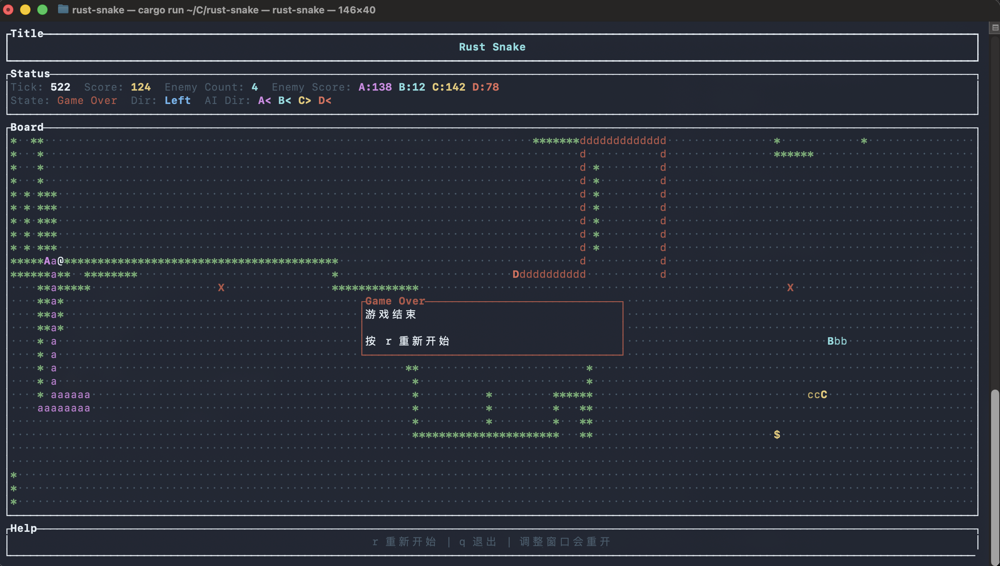

# rust-snake

一个基于 Rust、`ratatui` 和 `crossterm` 的终端贪吃蛇项目，支持玩家蛇与多条 AI 敌蛇同场对战，并带有尸体腐化、物品脉冲和短时闪光等渲染效果。

## 游戏截图



## 当前功能

- 终端 TUI 界面
- 160ms 固定逻辑 tick + 33ms 独立渲染帧
- `WASD` 和方向键控制玩家移动
- `Enter` / `Space` / 方向键开始游戏
- `Space` 暂停/继续
- `r` 重新开始
- `q` 退出
- 默认 4 条 AI 敌蛇同屏活动
- 支持 `--test-ai` 让玩家蛇也由 AI 接管
- 支持 `--no-color` 启动无色版本
- 支持 `--help` 查看命令行帮助
- 按当前窗口大小初始化棋盘
- 调整窗口后按新尺寸自动开始新游戏
- 终端窗口过小时显示提示
- 普通食物 `*`、超级食物 `$`、炸弹 `X`
- 普通食物与尸体食物会低频脉冲，超级食物会持续脉冲
- 蛇死亡后会拆成尸块，并按时间逐段腐化成可食用食物
- 尸体食物生成时会触发短时闪光
- AI 会优先追逐最近可吃物，并在少量概率下进入随机漫步
- 覆盖核心规则、尸体流转和渲染动画的单元测试

## 技术栈

- [Rust](https://www.rust-lang.org/)
- [ratatui](https://github.com/ratatui/ratatui)
- [crossterm](https://github.com/crossterm-rs/crossterm)
- [rand](https://crates.io/crates/rand)
- [anyhow](https://crates.io/crates/anyhow)

## 项目结构

```text
src/
  main.rs                 # CLI 入口，解析 --no-color / --test-ai / --help
  app.rs                  # 终端生命周期、事件循环、tick 与渲染调度
  config.rs               # 应用、玩法、渲染相关常量
  game/
    mod.rs                # GameState、共享类型与对外接口
    logic.rs              # tick 结算、碰撞、物品流转、尸体腐化
    ai.rs                 # AI 决策与安全性评估
    spawn.rs              # 玩家/敌蛇出生与重生
    snake.rs              # Snake 实体、控制模式、外观
    corpse.rs             # 尸块与渲染数据
    tests.rs              # 核心规则回归测试
  render/
    mod.rs                # 渲染入口与终端尺寸辅助
    board.rs              # 棋盘格子绘制
    panels.rs             # 标题、状态栏、帮助栏、弹窗
    animation.rs          # 脉冲和闪光动画状态
    style.rs              # 通用样式
```

## 运行方式

确保本地已经安装 Rust 工具链，然后在项目根目录执行：

```bash
cargo run
```

启动无色版本：

```bash
cargo run -- --no-color
```

让玩家蛇也由 AI 控制：

```bash
cargo run -- --test-ai
```

查看帮助：

```bash
cargo run -- --help
```

## 开发命令

```bash
cargo test
cargo fmt
cargo clippy -- -D warnings
cargo build --release
```

## 操作说明

- `W` / `A` / `S` / `D` 或方向键：移动
- `Enter` / `Space` / 方向键：开始游戏
- `Space`：暂停或继续
- `r`：重新开始
- `q`：退出游戏

## 游戏说明

### 角色符号

| 角色 | 符号 | 颜色 |
|------|------|------|
| 玩家蛇头 | `@` | 白色 |
| 玩家蛇身 | `o` | 白色 |
| 敌蛇头 | `A` `B` `C` `D` `E` `F` | 亮洋红 / 亮青 / 亮黄 / 亮红 / 亮蓝 / 白色 |
| 敌蛇身 | `a` `b` `c` `d` `e` `f` | 洋红 / 青 / 黄 / 红 / 蓝 / 灰色 |
| 尸块 | 沿用原蛇头身字符 | 沿用原蛇颜色 |
| 普通食物 / 尸体食物 | `*` | 绿色 |
| 超级食物 | `$` | 亮黄色 |
| 炸弹 | `X` | 红色 |
| 空格子 | `·` | 深灰色 |

### 核心规则

- 玩家蛇与默认 4 条 AI 敌蛇同屏对战
- 普通食物和尸体食物效果相同：`+1` 分、`+1` 节增长
- 超级食物效果为 `+4` 分、`+4` 节增长
- 炸弹会立即炸死触碰它的蛇，并在结算时从棋盘移除
- 普通食物默认补齐到 4 颗，超级食物最多 1 颗，炸弹最多 2 颗
- 尸体食物不占用普通食物配额，补货时仍会继续补齐常规食物
- 玩家或 AI 撞墙、撞自己、撞尸块、撞到其他蛇身体都会死亡
- 头撞头时按本帧结算后的体型比较，较小的一方死亡，同体型同死
- 玩家死亡后直接进入 `Game Over`
- AI 死亡后不会立刻重生，而是要等整条尸体都腐化完成后才会重生
- AI 重生会重置分数，不继承上一条命的得分
- 调整窗口大小会按新尺寸自动重开一局

### AI 行为

- 默认优先追逐最近的可吃物（普通食物、尸体食物、超级食物）
- 每次决策有 `5%` 概率进入随机漫步
- 随机漫步持续 `5` 到 `10` 步
- 非撞墙风险会尽量规避，包括炸弹、其他蛇身体以及可能输掉的头撞头
- 若所有安全方向都不可走，会保持当前方向并在下一步撞死

### Tick 处理流程

每 160ms 执行一次逻辑结算，主流程如下：

1. 推进已有尸块的腐化时间，并在条件满足时触发 AI 重生。
2. 解析玩家或 AI 的控制方向，计算各蛇下一步计划。
3. 统一做碰撞检测与头撞头结算。
4. 推进仍存活的蛇，消费对应格子的物品。
5. 将死亡蛇拆成尸块，补齐物品，并递增 `tick_count`。

### 尸体腐化与重生

- 蛇死亡后不会立刻变成普通食物，而是拆成多个独立尸块
- 每个尸块按顺序、每隔 `2` 个逻辑 tick 腐化一次
- 尸块腐化完成后，会在原地转成尸体食物 `*`
- AI 敌蛇只有在自己对应批次的尸块全部腐化后，才会尝试重生
- 重生优先尝试棋盘四角的预设出生形态，失败时再回退到随机位置

### 渲染反馈

- 普通食物和尸体食物使用低频脉冲强调可拾取状态
- 超级食物使用更明显的周期性脉冲
- 尸体食物生成瞬间会触发短时闪光
- `Ready`、`Paused`、`Game Over` 状态会显示居中覆盖层
- 终端窗口过小时会显示专门的提示界面

## 测试

当前测试覆盖重点包括：

- 玩家移动、反向输入限制与边界碰撞
- AI 出生位置、避险行为与头撞头判定
- 超级食物增长、炸弹结算与物品补货
- 尸块逐段腐化、尸体食物流转与 AI 延迟重生
- 渲染层脉冲与闪光动画状态

## 开发状态

当前状态：已完成多 AI 对战、尸体腐化与基础动画反馈的终端版贪吃蛇。
